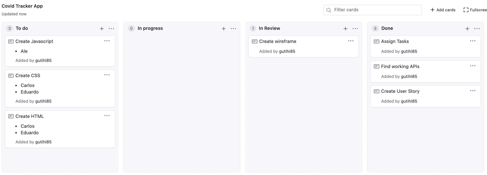
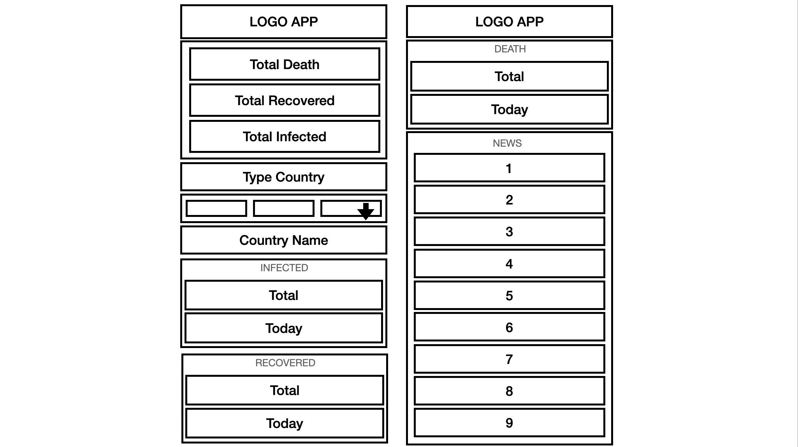
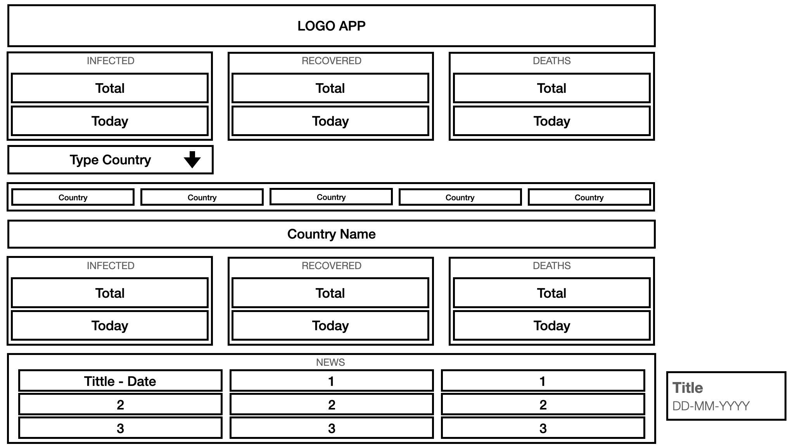

# Covid_Tracker
​
App for to keep users informed of Covid statistics and news, globally and per country. 
​
## User Story:
​
* As a world citizen I want to keep track of the development of the virus across the world and in individual countries. 
​
## Acceptance Criteria:
​
* GIVEN I am an app user
* WHEN I enter the app 
* THEN I am presented the global statistics (Infected, recovered, death (Total and day specific))
* WHEN I enter the name of a specific country 
* THEN I am presented the specific country statistics (Infected, recovered, death (Total and day specific))
* WHEN I scroll down 
* THEN I can see the main news realted to covid about the chosen country (title and date)
* WHEN I click on the news I am interested in
* THEN I am redirected to the complete article
​
## TBD APIs 
​
* COVID NEWS API: https://content.guardianapis.com/search?q=covid&api-key=962e64d3-a7ad-4bb9-8881-a000ce805d15
* NEWS API DOCUMENTATION: https://open-platform.theguardian.com/documentation/
* COVID STATS: https://disease.sh/docs/
​
## TASKS PREVIEW
​

​
## WIREFRAME
​

